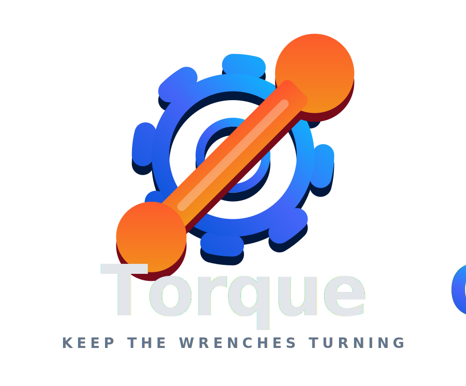

# TorqueOS` <h3>`Multi-Tenant Automotive Repair Management Platform`</h3>`

A production-ready SaaS platform for automotive repair shop management, featuring multi-tenant architecture with shared-schema isolation, role-based access control, Stripe subscription billing, and a "Precision Industrial" design system.` `
Built with **Flask 3.1**, **SQLAlchemy 2.0**, **Neon PostgreSQL**, **Google OAuth**, and **Bootstrap 5.3**.` `
One-click deployment to **Heroku** with cloud-native database on **Neon**.

[Live Demo][project-link] · [Documentation](docs/) · [Report Bug][github-issues-link] · [Request Feature][github-issues-link]

` `

` `

<!-- SHIELD GROUP -->

[![][python-shield]][python-link]
[![][flask-shield]][flask-link]
[![][sqlalchemy-shield]][sqlalchemy-link]
[![][postgresql-shield]][postgresql-link]
[![][stripe-shield]][stripe-link]
[![][heroku-shield]][heroku-link]
[![][bootstrap-shield]][bootstrap-link]
[![][license-shield]][license-link]

``Built for the next generation of automotive repair shop management.``

**Tech Stack:**

 
 
 
 
 
 

> [!IMPORTANT]
> This project is a comprehensive multi-tenant SaaS platform that combines Flask backend with a modern Bootstrap 5.3 frontend. It features shared-schema multi-tenancy, 6-role RBAC, Stripe subscription billing, Google OAuth, 4-step onboarding, inventory management, and a full-featured admin/technician portal with real-time analytics.

<kbd>📑 Table of Contents</kbd>

#### TOC

- [🌟 Introduction](#-introduction)
- [✨ Key Features](#-key-features)
  - [`1` Multi-Tenant SaaS Architecture](#1-multi-tenant-saas-architecture)
  - [`2` Role-Based Dual Portals](#2-role-based-dual-portals)
  - [`3` Stripe Subscription Billing](#3-stripe-subscription-billing)
  - [`*` Additional Features](#-additional-features)
- [🛠️ Tech Stack](#️-tech-stack)
- [🏗️ Architecture](#️-architecture)
- [📊 Database Schema](#-database-schema)
- [🚀 Getting Started](#-getting-started)
- [🛳 Deployment](#-deployment)
- [📖 API Reference](#-api-reference)
- [⌨️ Development](#️-development)
- [🤝 Contributing](#-contributing)
- [📄 License](#-license)
- [🙋‍♀️ Author](#️-author)

 

<!-- ═══════════════════════════════════════════════════════════════════════════
     SECTION: Introduction
     ═══════════════════════════════════════════════════════════════════════════ -->

## 🌟 Introduction

<table>
<tr>
<td>

> [!NOTE]
>
> - Python 3.9+ required
> - Neon PostgreSQL account required for cloud database (SQLite used for local testing)
> - Google Cloud Console account optional (for OAuth sign-in)
> - Stripe account optional (for subscription billing)

| [![][demo-shield-badge]][project-link] | No installation required! Visit the live demo to experience it firsthand. |
| :------------------------------------- | :------------------------------------------------------------------------ |

[![][back-to-top]](#readme-top)

<!-- ═══════════════════════════════════════════════════════════════════════════
     SECTION: Key Features
     ═══════════════════════════════════════════════════════════════════════════ -->

## ✨ Key Features

### `1` Multi-Tenant SaaS Architecture

Complete shared-schema multi-tenancy with automatic data isolation. Each organization operates in its own workspace with independent service catalogs, customer records, and team management — all on a single database deployment.

Key capabilities include:

- 🏢 **Organization Management**: Create and configure multiple repair shops with custom settings
- 🔒 **Data Isolation**: `TenantScopedMixin` automatically filters all queries by `tenant_id`
- 👥 **Team Invitations**: Invite team members with role-based permissions
- 🚀 **4-Step Onboarding**: Guided setup for business details, service catalog, parts catalog, and team
- 🌐 **Tenant-Scoped URLs**: Routes available at both `/technician/...` and `/org/<slug>/technician/...`

[![][back-to-top]](#readme-top)

### `2` Role-Based Dual Portals

Two distinct portal experiences for Technicians and Administrators, controlled by a 6-role RBAC system defined on `TenantMembership`:

**Technician Portal:**

- 📋 Work order management with pagination
- 🔧 Add services and parts to jobs with quantity tracking
- 💰 Real-time total cost calculation
- ✅ Job completion workflow

**Administrator Portal:**

- 👤 Customer management with search (first name, family name, or both)
- 💳 Billing management with overdue tracking (14-day threshold)
- 📦 Service & parts catalog management with categories and descriptions
- 📊 Inventory tracking with reorder alerts and stock adjustments
- 👥 Team member management with role assignment
- 📈 Dashboard with Chart.js analytics (monthly revenue, job status distribution)
- ⚙️ Organization settings and subscription management

**RBAC Roles:**

| Role          | Key Permissions                                             |
| ------------- | ----------------------------------------------------------- |
| `owner`       | Full access including organization management               |
| `admin`       | User management, catalog, inventory, jobs, billing, reports |
| `manager`     | Jobs, customers, billing, reports                           |
| `technician`  | Jobs, reports                                               |
| `parts_clerk` | Catalog, inventory, reports                                 |
| `viewer`      | Reports only                                                |

[![][back-to-top]](#readme-top)

### `3` Stripe Subscription Billing

Integrated SaaS billing with Stripe for subscription management:

- 💎 **4 Plans**: Free, Starter ($29/mo), Professional ($79/mo), Enterprise ($199/mo)
- 🎁 **14-Day Trial**: Free trial period for new organizations
- 🛒 **Stripe Checkout**: Hosted payment pages for secure card processing
- 🔄 **Billing Portal**: Customer self-service for plan changes and payment methods
- 📡 **Webhook Handling**: Automatic subscription status updates on payment events

[![][back-to-top]](#readme-top)

### `*` Additional Features

- [x] 🔐 **Google OAuth 2.0**: One-click sign-in via Authlib integration
- [x] 🔑 **JWT Authentication**: Optional Neon Auth (Better Auth) JWT verification
- [x] 🛡️ **CSRF Protection**: Token-based CSRF on all state-changing requests
- [x] 🧹 **Input Sanitization**: XSS prevention and SQL injection scanning
- [x] 🔒 **Security Headers**: HSTS, X-Frame-Options, X-Content-Type-Options
- [x] 🔐 **Password Security**: PBKDF2 hashing with 100,000 iterations
- [x] 🎨 **Precision Industrial Design**: Steel blue (#1e3a5f) + signal orange (#e85d04) palette
- [x] 📱 **Responsive Layout**: Mobile-first with breakpoints at 768px and 480px
- [x] 📊 **Chart.js Dashboards**: Monthly revenue line charts, job status doughnut charts
- [x] 🔍 **Global Search**: Async customer search with API integration
- [x] ⌨️ **Keyboard Shortcuts**: Ctrl+K for search, Esc for close
- [x] 🔔 **Toast Notifications**: Real-time feedback for user actions
- [x] 📄 **Alembic Migrations**: Versioned database schema migrations

> ✨ More features are continuously being added as the project evolves.

[![][back-to-top]](#readme-top)

<!-- ═══════════════════════════════════════════════════════════════════════════
     SECTION: Tech Stack
     ═══════════════════════════════════════════════════════════════════════════ -->

## 🛠️ Tech Stack

  <table>
    <tr>
      <td align="center" width="96">
        
         Python 3.9+
      </td>
      <td align="center" width="96">
        
         Flask 3.1.3
      </td>
      <td align="center" width="96">
        
         Neon PG
      </td>
      <td align="center" width="96">
        
         Stripe
      </td>
      <td align="center" width="96">
        
         Bootstrap 5.3
      </td>
      <td align="center" width="96">
        
         Chart.js 4.4
      </td>
      <td align="center" width="96">
        
         Heroku
      </td>
    </tr>
  </table>

**Backend:**

- **Framework**: Flask 3.1.3 with application factory pattern
- **ORM**: SQLAlchemy 2.0.36 with custom model mixins
- **Database**: Neon PostgreSQL (cloud) / SQLite (testing)
- **Migrations**: Alembic 1.14.0
- **Authentication**: Authlib 1.6.6 (Google OAuth) + PyJWT 2.10.1 (Neon Auth)
- **Payments**: Stripe 11.4.1 (subscriptions, checkout, webhooks)
- **WSGI Server**: Gunicorn 23.0.0

**Frontend:**

- **Framework**: Bootstrap 5.3 with custom CSS design system
- **Charts**: Chart.js 4.4.0 for data visualization
- **Icons**: Lucide Icons (CDN, client-side rendering)
- **Typography**: DM Sans + Source Sans 3 + JetBrains Mono (Google Fonts)
- **JavaScript**: Vanilla ES6+ (no build tools required)

**DevOps:**

- **Deployment**: Heroku with Procfile (Gunicorn)
- **Database**: Neon PostgreSQL (serverless, auto-scaling)
- **Code Quality**: Black (formatting), isort (imports), flake8 (linting), mypy (types)
- **Testing**: pytest + pytest-cov (70% minimum threshold)

> [!TIP]
> Each technology was selected for production readiness, simplicity, and Flask ecosystem compatibility. No frontend build step is required — static assets are served directly by Flask.

[![][back-to-top]](#readme-top)

<!-- ═══════════════════════════════════════════════════════════════════════════
     SECTION: Architecture
     ═══════════════════════════════════════════════════════════════════════════ -->

## 🏗️ Architecture

> [!TIP]
> The architecture follows Flask best practices with a clear separation of concerns: views handle HTTP, services encapsulate business logic, and models manage data access with automatic tenant scoping.

<table>
<tbody>
<tr></tr>
<tr>
<td width="10000">

[![][back-to-top]](#readme-top)

<!-- ═══════════════════════════════════════════════════════════════════════════
     SECTION: Database Schema
     ═══════════════════════════════════════════════════════════════════════════ -->

## 📊 Database Schema

<table>
<tbody>
<tr></tr>
<tr>
<td width="10000">

[![][back-to-top]](#readme-top)

